# Ubuntu Linux Home Lab
     
## Project Overview

This project documents my Linux Home Lab built using Ubuntu Server in VMware Workstation.

The purpose of this lab was to gain hands-on experience with Linux system administration, Bash scripting, SSH, Docker, firewall configuration, and common command-line tools used in IT support and system administration roles.

---

## Skills Demonstrated

- Ubuntu Server Installation
- Linux Command Line
- File & Directory Management
- File Permissions (chmod)
- Nano Text Editor
- Bash Scripting
- SSH Configuration
- UFW Firewall
- Systemctl Service Management
- Docker Installation
- Docker Container Deployment
- Basic Linux Troubleshooting

---

## Technologies Used

- Ubuntu Server 24.04 LTS
- VMware Workstation
- Bash
- OpenSSH
- Docker
- UFW Firewall

---

## Project Structure

```
ubuntu-linux-home-lab/
│
├── docs/
├── scripts/
│   ├── greeting.sh
│   ├── countdown.sh
│   ├── favorite_os.sh
│   ├── system_info.sh
│   └── linux_checker.sh
│
├── screenshots/
│
└── README.md
```

---


## Screenshots

### Ubuntu Installation

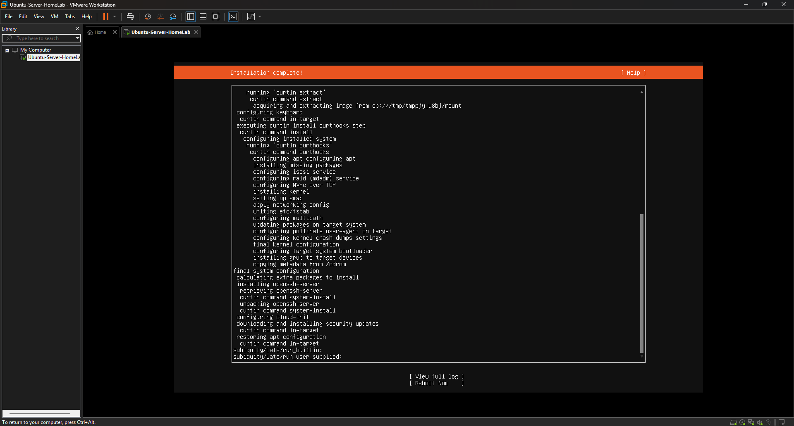

---

### First Login

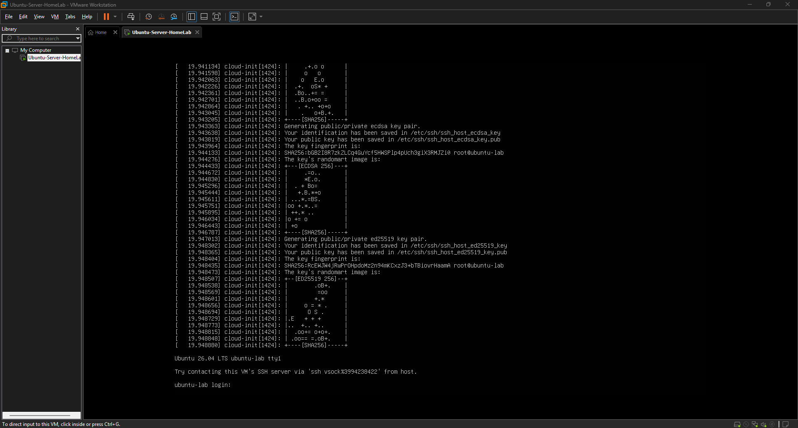

---

### Terminal Navigation

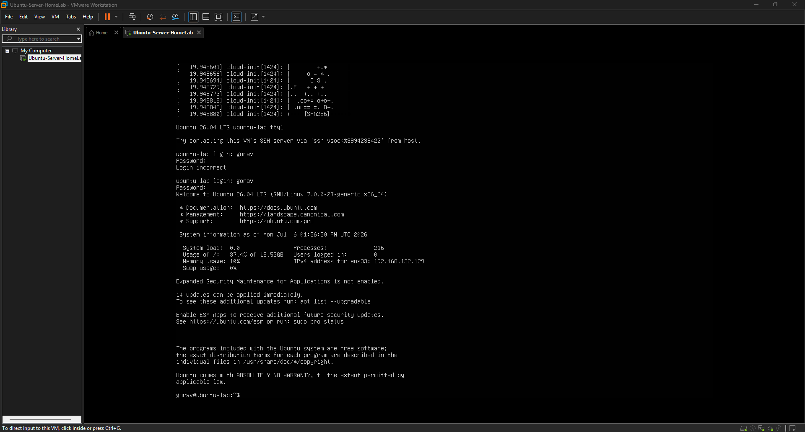

---

### File Creation

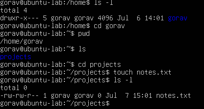

---

### Editing Files with Nano

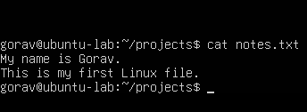

---

### File Permissions (chmod)

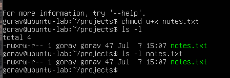

---

### Tree Command

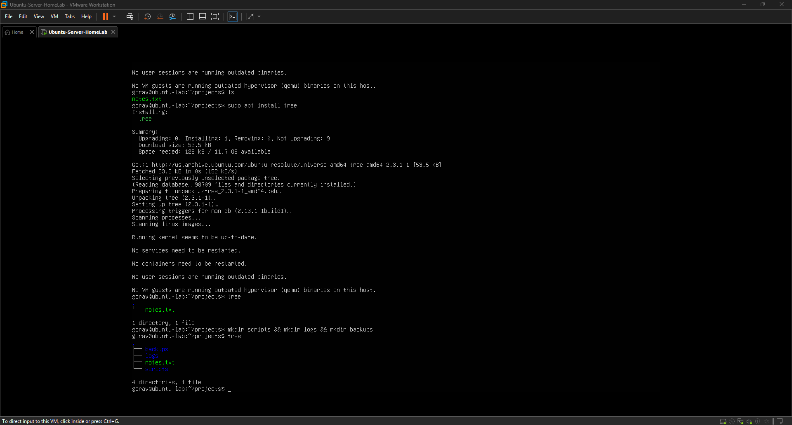

---

### SSH Connection

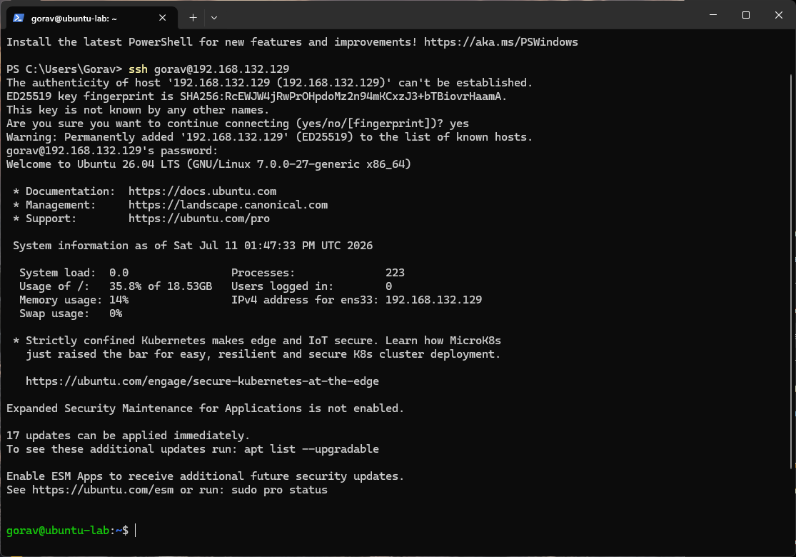

---

### Firewall Configuration (UFW)

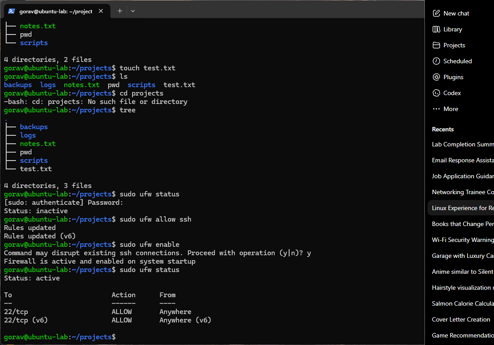

---

### Docker Hello World

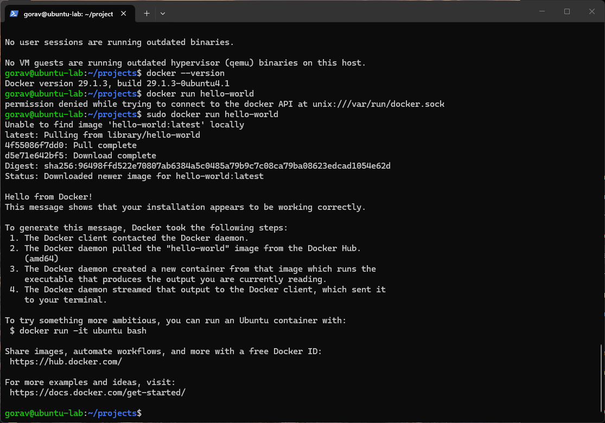

---

## Bash Scripting

### Linux Checker Script

This script combines variables, user input, conditionals, loops, and Linux commands to display system information.

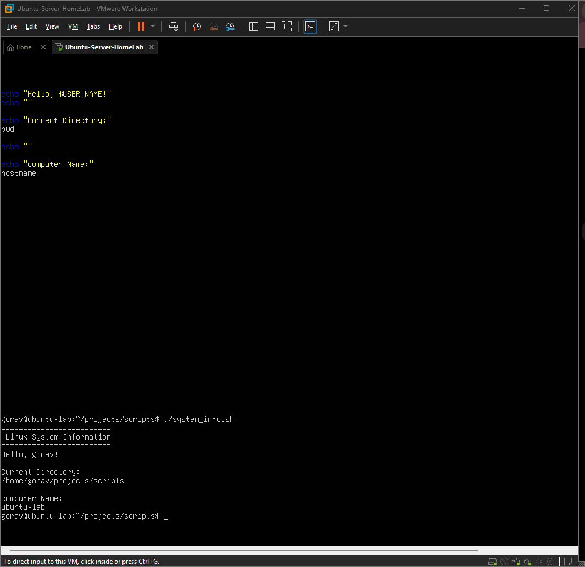


### Greeting Script

Uses variables and user input to display a personalized greeting.
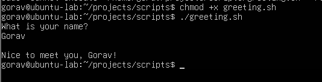

### Countdown Script

Demonstrates Bash for loops by counting down from 5 before displaying "Blast Off!".
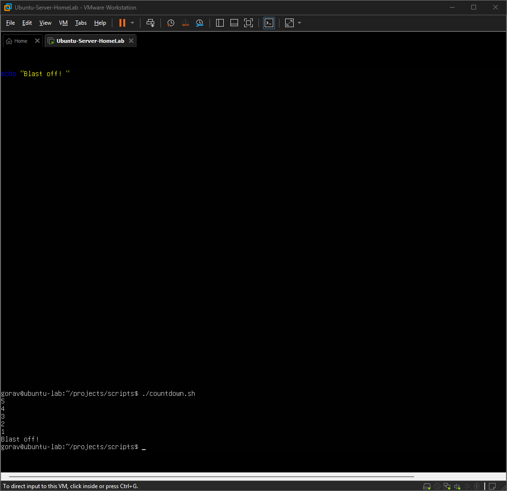

## What I Learned

This Linux Home Lab strengthened my understanding of Linux system administration and command-line tools commonly used in IT support and system administration roles.

Throughout this project I gained experience with:

- Linux command-line navigation
- File and directory management
- File permissions using `chmod`
- Editing files with Nano
- Bash scripting fundamentals
- Variables, loops, and conditional statements
- SSH remote administration
- UFW firewall configuration
- Docker installation and container deployment
- System service management with `systemctl`
- Troubleshooting common Linux issues

This project gave me practical, hands-on experience working in a Linux environment similar to what is used in many enterprise IT environments.
